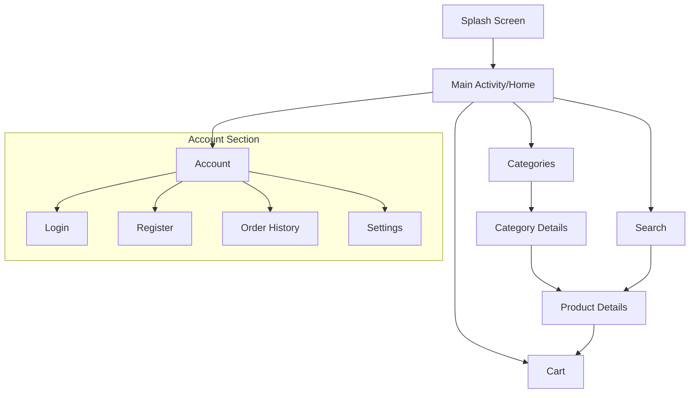

# Computer Parts Shop - App Structure

## Overview
This document outlines the structure and features of the Computer Parts Shop Android application.

## Screen Structure

## Detailed Screen Breakdown

### 1. Splash Screen
- App logo
- Loading animation
- Version info

### 2. Main Activity/Home
- Featured products
- Popular categories
- Special offers
- Bottom navigation
- Search bar

### 3. Categories
- CPU/Processors
- Motherboards
- Graphics Cards
- RAM
- Storage (SSD/HDD)
- Power Supplies
- Cases
- Cooling Systems

### 4. Product Details
- Product images
- Specifications
- Price
- Stock status
- Reviews
- Add to cart button
- Similar products

### 5. Search
- Search bar
- Filters (price, brand, etc.)
- Sort options
- Search history

### 6. Shopping Cart
- Product list
- Quantity adjustment
- Price summary
- Checkout button

### 7. Account
- User profile
- Order history
- Saved addresses
- Payment methods
- Settings
- Logout

### 8. Checkout Process
- Address selection
- Payment method
- Order summary
- Confirmation

## Implementation Notes
- The app will use a bottom navigation bar for main navigation
- Each product category will have its own listing page
- Product details will include comprehensive specifications
- Cart will persist between sessions
- User authentication required for checkout process