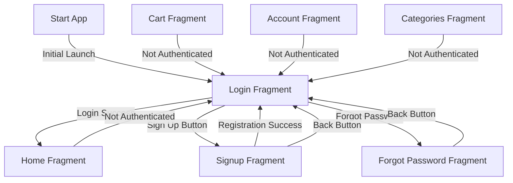

# Authentication-First Implementation Plan

## Overview
This document outlines the plan for modifying the Java Shop Android application to require authentication before accessing any other features. This means making the login and register pages the first screens users see when launching the app.

## Current State
- App currently starts at HomeFragment
- Authentication is optional
- Users can browse products and categories without logging in
- Login/register are accessible through AccountFragment

## Desired State


## Implementation Steps

### 1. Navigation Changes
- Modify nav_graph.xml:
  - Change start destination from homeFragment to loginFragment
  - Update navigation actions for proper flow
  - Add appropriate popUpTo and popUpToInclusive attributes for clean navigation

### 2. Session Management Updates
- Enhance SessionManager.java:
  - Add isAuthenticated() check method
  - Implement forced logout functionality
  - Add authentication state listeners
  - Handle deep linking and saved states

### 3. Fragment Updates
- Update protected fragments:
  - HomeFragment
  - CartFragment
  - CategoriesFragment
  - AccountFragment
  - CategoryDetailsFragment
  - ProductDetailsFragment
  - CheckoutFragment
  
Changes needed:
- Add authentication check in onCreateView
- Implement navigation to login when not authenticated
- Handle deep linking and saved instance state
- Preserve intended destination for post-login navigation

### 4. Activity Changes
- Update MainActivity.java:
  - Add authentication state observer
  - Handle navigation based on auth state
  - Implement deep link handling
  - Update bottom navigation visibility based on auth state

### 5. Authentication Flow
- Update LoginFragment:
  - Handle deep links and saved destinations
  - Implement successful login navigation
  - Add proper error handling
  
- Update SignupFragment:
  - Implement successful registration flow
  - Add proper validation
  - Handle navigation after registration

### 6. Testing Requirements
1. Authentication Flow Tests:
   - Initial app launch -> Login screen
   - Login success -> Home screen
   - Login failure -> Stay on Login with error
   - Registration flow
   - Forgot password flow

2. Protected Routes Tests:
   - Attempt to access protected routes when not authenticated
   - Deep linking to protected routes
   - Session expiration handling
   - Logout functionality

3. Navigation Tests:
   - Back stack behavior
   - Up navigation
   - Bottom navigation behavior
   - Deep link handling

## Technical Details

### Navigation Graph Changes
```xml
<navigation xmlns:android="...">
    <fragment
        android:id="@+id/loginFragment"
        android:name="com.example.java_shop.fragments.LoginFragment"
        android:label="Login">
        <!-- Navigation actions -->
    </fragment>
    
    <!-- Other fragments with updated actions -->
</navigation>
```

### Session Manager Updates
```java
public class SessionManager {
    // New methods to add
    public boolean isAuthenticated() {
        // Check authentication state
    }
    
    public void enforceAuthentication() {
        // Handle authentication enforcement
    }
    
    public void handleDeepLink(String destination) {
        // Handle deep linking
    }
}
```

### Protected Fragment Template
```java
public class ProtectedFragment extends Fragment {
    @Override
    public void onCreateView() {
        if (!sessionManager.isAuthenticated()) {
            navigateToLogin();
            return;
        }
        // Normal fragment initialization
    }
}
```

## Implementation Order
1. Update SessionManager with new authentication methods
2. Modify navigation graph
3. Update MainActivity
4. Implement protected fragment changes
5. Update login/signup flow
6. Add deep linking support
7. Write tests
8. Manual testing and bug fixes

## Risks and Mitigations
1. Risk: Deep link handling complexity
   - Mitigation: Implement robust deep link queue system

2. Risk: Back stack issues
   - Mitigation: Carefully test and configure popUpTo behaviors

3. Risk: User experience disruption
   - Mitigation: Add proper error messages and loading states

## Success Criteria
1. All protected routes require authentication
2. Clean navigation flows
3. Proper deep link handling
4. Preserved user experience
5. All tests passing

## Next Steps
1. Begin implementation by updating SessionManager
2. Modify navigation graph
3. Update protected fragments
4. Implement complete test suite
