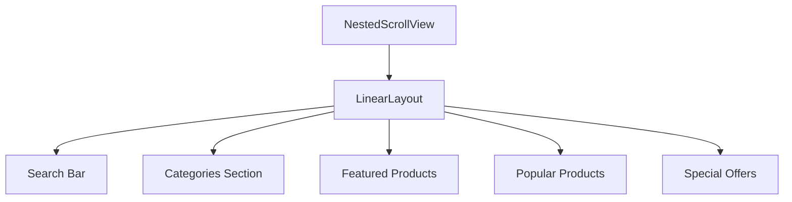

# Home Screen Implementation Plan

## 1. Layout Structure (fragment_home.xml)



### Components
1. Search Bar
   - MaterialSearchBar with icon
   - Click opens search fragment

2. Categories Section
   - Horizontal RecyclerView
   - Category cards with icons
   - Quick navigation to category pages

3. Featured Products Carousel
   - ViewPager2 with indicator
   - Auto-scrolling banner
   - Featured product cards

4. Popular Products Grid
   - Grid RecyclerView (2 columns)
   - Product cards with:
     * Product image
     * Name
     * Price
     * Rating
     * Add to cart button

5. Special Offers Section
   - Horizontal RecyclerView
   - Offer cards with:
     * Discount information
     * Valid until date
     * Product details

## 2. Required Adapters

1. `CategoryAdapter.java`
   - Horizontal scrolling categories
   - Click handling for category navigation

2. `FeaturedProductAdapter.java`
   - ViewPager2 adapter for featured products
   - Auto-scrolling functionality
   - Click handling for product details

3. `ProductGridAdapter.java`
   - Grid layout for popular products
   - Product card layout
   - Add to cart functionality

4. `SpecialOffersAdapter.java`
   - Horizontal scrolling offers
   - Offer card layout
   - Click handling for offer details

## 3. ViewModel Implementation (HomeViewModel.java)

### Data Management
```java
// LiveData fields
private LiveData<List<Category>> categories;
private LiveData<List<Product>> featuredProducts;
private LiveData<List<Product>> popularProducts;
private LiveData<List<Offer>> specialOffers;

// Methods
public void loadFeaturedProducts(int limit);
public void loadPopularProducts(int limit);
public void loadActiveCategories();
public void loadSpecialOffers();
public void addToCart(Product product);
```

### Features
1. Category Management
   - Load active categories
   - Category selection tracking

2. Product Loading
   - Featured products carousel
   - Popular products grid
   - Pagination for product grid

3. Special Offers
   - Current offers list
   - Offer validity checking

4. Cart Integration
   - Add to cart functionality
   - Cart item count tracking

## 4. Cart Integration

1. Cart Badge
   - Show item count on cart icon
   - Update badge in real-time

2. Add to Cart
   - Quick add from product cards
   - Quantity selection dialog
   - Success/error feedback

## 5. Implementation Steps

1. Layout Implementation
   ```
   1.1 Create layout files
       - fragment_home.xml (main layout)
       - item_category.xml (category card)
       - item_featured_product.xml (featured product slide)
       - item_product_grid.xml (product grid item)
       - item_special_offer.xml (offer card)
   
   1.2 Add necessary drawables
       - Category icons
       - Placeholder images
       - Custom backgrounds
   ```

2. Adapter Implementation
   ```
   2.1 Create base adapter classes
   2.2 Implement view holders
   2.3 Add data binding
   2.4 Implement click listeners
   ```

3. ViewModel Setup
   ```
   3.1 Create HomeViewModel
   3.2 Set up LiveData observers
   3.3 Implement data loading methods
   3.4 Add cart integration
   ```

4. Fragment Updates
   ```
   4.1 Update HomeFragment
   4.2 Initialize adapters
   4.3 Set up observers
   4.4 Implement error handling
   ```

## 6. Testing Plan

1. Unit Tests
   - ViewModel tests
   - Repository integration tests
   - Data loading tests

2. UI Tests
   - RecyclerView scrolling
   - ViewPager2 swiping
   - Add to cart functionality

3. Integration Tests
   - Data flow testing
   - Cart integration testing
   - Navigation testing

## 7. Success Criteria

- [ ] Home screen loads within 2 seconds
- [ ] Smooth scrolling performance
- [ ] Correct display of all sections
- [ ] Working category navigation
- [ ] Functional product details navigation
- [ ] Working add to cart functionality
- [ ] Real-time cart badge updates
- [ ] Error states handled gracefully