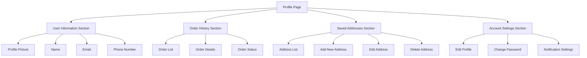
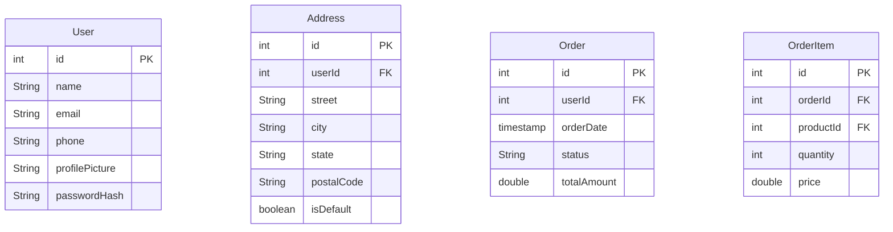

# Profile Page Implementation Plan

## Overview
This document outlines the implementation plan for the Java Shop profile page, which will include user information, order history, saved addresses, and account settings.

## Component Structure

## Database Schema

## Implementation Steps

### 1. Database Layer
- Create new data models:
  * User.java
  * Address.java
  * Order.java
  * OrderItem.java
- Create corresponding DAOs:
  * UserDao.java
  * AddressDao.java
  * OrderDao.java
- Update ComputerShopDatabase.java with new entities
- Create repositories:
  * UserRepository.java
  * AddressRepository.java
  * OrderRepository.java

### 2. UI Components
- Update fragment_account.xml:
  * Profile header with user info and picture
  * Section cards for orders, addresses, settings
  * RecyclerViews for orders and addresses
  * Settings menu items
- Create new layouts:
  * item_order.xml
  * item_address.xml
  * fragment_edit_profile.xml
  * fragment_address_form.xml
  * fragment_order_details.xml

### 3. View Models
- AccountViewModel.java:
  * Manage profile data
  * Handle settings changes
  * Coordinate with repositories
- OrderViewModel.java:
  * Handle order history
  * Manage order details
- AddressViewModel.java:
  * Manage address CRUD operations

### 4. Navigation
- Update nav_graph.xml with new destinations:
  * Edit profile
  * Address form
  * Order details
- Implement navigation between sections
- Add transitions and animations

### 5. Implementation Order
1. Basic Profile Setup
   - User database setup
   - Basic profile UI
   - Edit profile functionality

2. Address Management
   - Address database implementation
   - Address list UI
   - Address CRUD operations

3. Order History
   - Order database setup
   - Order list UI
   - Order details view

4. Settings and Customization
   - Settings UI
   - Notification preferences
   - Password change functionality

## Next Steps
1. Start with database implementation
2. Create basic UI structure
3. Implement core functionality
4. Add polish and refinements